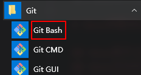
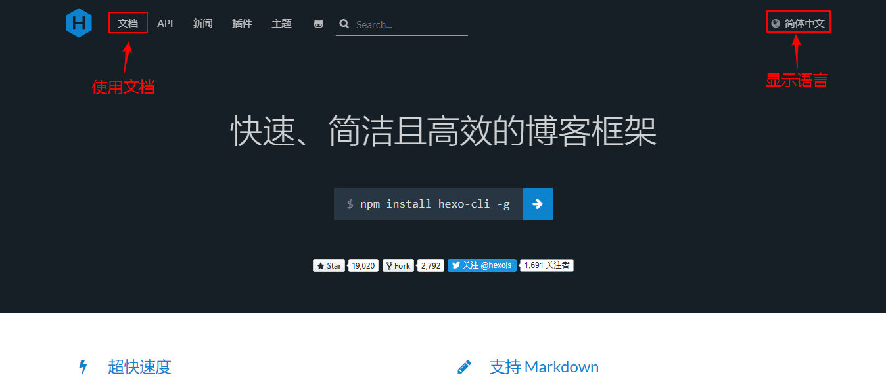
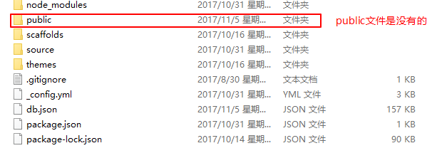
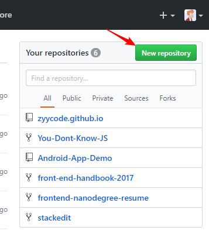
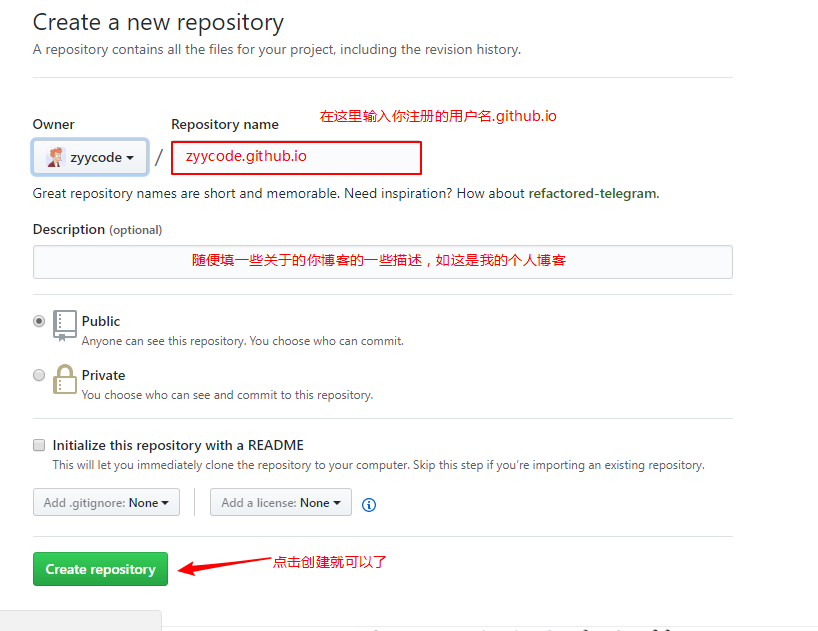
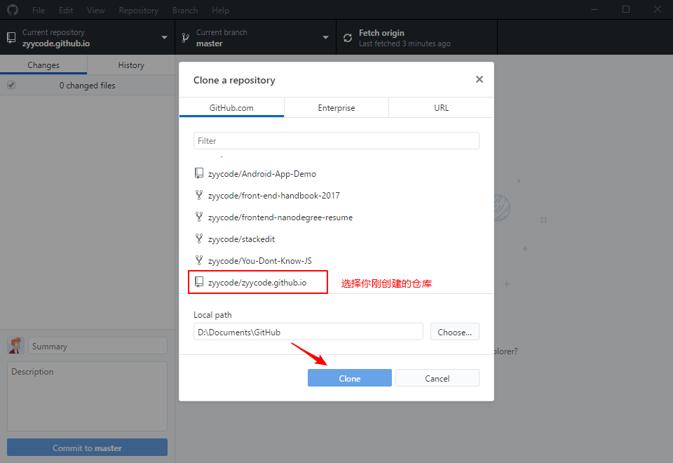
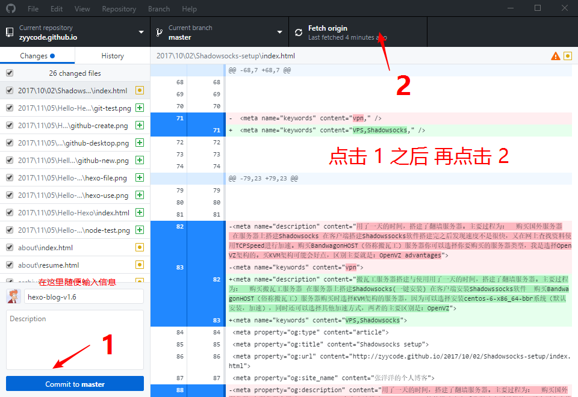

# Hexo

官网地址：[https://hexo.io/](https://hexo.io/)

## 安装 `nodejs` 和 `git` 

在使用Hexo之前，必须要先安装[node.js](http://nodejs.cn/)和[Git](https://git-scm.com/),下载完之后和一般安装软件一样点击下一步就可以。安装完之后打开命令提示符或者 `WIN + R` 输入 `cmd`,输入 `node -v`,若成功则下图所示:


<!-- more -->

在开始菜单中找到 `Git -> Git Bush`,则安装成功。


## 安装Hexo

在[Hexo官网](https://hexo.io/)中，可查看相关命令来进行下载安装，通过文档来进行使用，简单易上手。


```
# Hexo使用命令
$ npm install hexo-cli -g #在全局下安装`hexo-cli`
$ hexo init blog          #在当前地址创建`blog`文件
$ cd blog                 #进入到`blog`文件中
$ npm install             #使用`npm`进行安装
$ hexo server             #在本次启动服务器进行预览
```
安装完之后可以在blog文件夹中看到相关文件:

 具体使用可查看[Hexo官方文档](https://hexo.io/zh-cn/docs/) 

# Hexo部署到Github

## 在Github上注册账号

## 新建 `username.github.io` 仓库
## 进入Github网站，输入你的账号密码后点击 `New repository`

## 点击完之后，填写相关信息创建该仓库

## 在本地生成静态文件
```
$ hexo new "post-name"  //新建一片文章
$ hexo genernate        //生成静态文件在public文件家中
$ hexo deploy           //上传到GitHub上
```
> **在每次 `hexo g` 前最好先使用 `hexo clean`**

## 使用 `hexo deploy` 上传到GitHub
可能会出现22号端口链接错误，需要进行git配置：
1. 生成 `ssh密钥`
2. 在你的GitHub账户中添加生成的ssh密钥
3. 在本地的 `~/.ssh`文件夹中建立 `config` 文件，并添加：
```
Host github.com
  Hostname ssh.github.com
  Port 443
```
在上传之前需要在 `站点配置文件` 中修改地址
```
url: http://zyycode.github.io
root: /
```

## 使用GitHub Desktop上传
[下载Github Desktop](https://desktop.github.com/)
选择 `file -> clone repository` 在本地创建仓库后，然后将你 `public` 文件夹中的文件拷贝中刚克隆的 `zyycode.github.io` 文件中。



## 在浏览中输入域名访问网站
完成之后就可以在浏览器中输入[https://zyycode.github.io/](https://zyycode.github.io/)就可以查看你的博客了

# Hexo进阶使用

## Hexo更改主题
> 我使用的是[Next主题](http://theme-next.iissnan.com/)

在`Hexo主题` 选择你喜欢的主题，可以选择 `git` 下载 或者直接克隆下载文件到你的 `~\blog\themes` 目录下,同时在 `站点配置文件` 中修改。
```
theme: next
```
## 添加分类页面和标签页面
```
$ hexo new page categories
$ hexo new page tags
```
[新建分类页面](http://theme-next.iissnan.com/theme-settings.html#categories-page)
[新建标签页面](http://theme-next.iissnan.com/theme-settings.html#tags-page)
## [搜索功能](http://theme-next.iissnan.com/third-party-services.html#local-search)
## [评论功能](http://theme-next.iissnan.com/third-party-services.html#comment-system)
## [赞赏功能](http://theme-next.iissnan.com/theme-settings.html#reward)
## [腾讯404工艺页面](http://theme-next.iissnan.com/theme-settings.html#volunteer-404)

