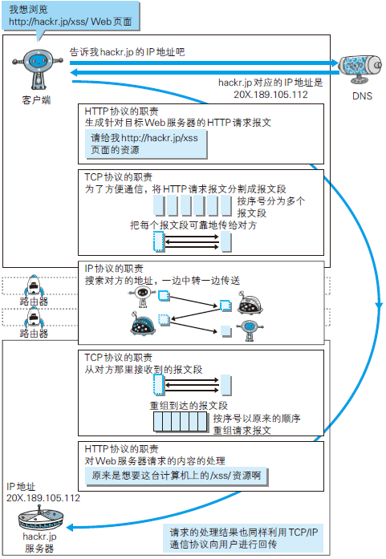

# 了解 Web 及网络基础

## 使用 HTTP 协议访问 Web

当我们使用浏览器时，在地址栏输入[www.baidu.com](https://www.baidu.com/)后，页面信息是如何呈现的呢？其实当我们在地址栏输入`URL`后，浏览器就会从服务器获取文件资源等信息，然后显示到浏览器上面。就比如，卖家在网上买东西，选购填写自己的地址信息后，然后卖家会根据你的地址通过快递公司发货给你，地址信息就相当于`URL`，卖家就相当于服务器，买家就相当于浏览器，快递公司就相当于传输协议（`HTTP协议`）。

HTTP（HyperText Transfer Protocol，超文本传输协议，严谨来说应该叫超文本转移协议），完成从客户端到服务端等一系列运作流程。可以说，Web 是建立在 HTTP 协议上通信的。

<!-- more -->

## 网络基础 TCP/IP

### TCP/IP 协议族

`协议`: 不同的硬件、操作系统之间的通信规则。
`TCP/IP`: 与互联网相关的协议的集合。


### TCP/IP 分层管理

- 应用层：决定了向用户提供应用服务时通信的活动
- 传输层：对上层应用层，提供处于网络连接中的两台计算机之间的数据传输
- 网络层（网络互连层）：处理在网络上流动的数据包
- 链路层（数据链路层，网络接口层）：处理连接网络的硬件部分

### TCP/IP 通信传输流

利用 TCP/IP 协议族进行网络通信时，会通过分层顺序与对方进行
通信。发送端从应用层往下走，接收端则往应用层往上走。

发送端在层与层之间传输数据时，每经过一层时必定会被打上一个
该层所属的首部信息。反之，接收端在层与层传输数据时，每经过一层时会把对应的首部消去。这种把数据包装起来的做法称为`封装`。

## 与HTTP 关系密切的协议：IP、TCP 和 DNS

### 负责传输的 IP 协议

`IP`是一种协议的名称；`IP地址`是一串数字。IP协议的作用是把各种数据包传送给对方。IP 地址和 MAC 地址时确保传输到对方的两个重要条件。
在网络上，通信的双方在同一局域网（LAN）内的情况是很少的，通常是经过多台计算机和网络设备中转才能连接到对方。而在进行中转时，会利用下一站中转设备的 MAC 地址来搜索下一个中转目标。这时，会采用 ARP 协议（Address Resolution Protocol）。ARP 是一种用以解析地址的协议，根据通信方的IP 地址就可以反查出对应的 MAC 地址。

### 确保可靠性的 TCP 协议

为了准确无误地将数据送达目标处，TCP 协议采用了三次握手（three-way handshaking）策略。

### 负责域名解析的 DNS 服务

DNS（Domain Name System）服务是和HTTP协议一样位于应用层的协议。它提供域名到 IP 地址之间的解析服务。

## 各种协议与 HTTP 协议的关系

## URI 和 URL

`URI`：统一资源标识符(Uniform Resource Indentifier)用来标识服务器上的资源。
`URL`:统一资源定位符(Uniform Resouce Locator)是资源标识符最常见的表示格式。
URL时URI的子集。
区别：URI 定义资源，而 URL 不单定义这个资源，还定义了如何找到这个资源（即访问资源的方式）。

**参考：**
[《HTTP 协议中 URI 和 URL 有什么区别？》](https://www.zhihu.com/question/21950864)

### 绝对 URI 格式

## 参考：

[《图解HTTP》](https://book.douban.com/subject/25863515/)