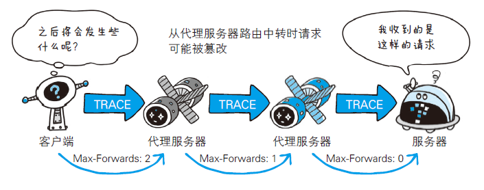

# 简单的 HTTP 协议

## 1. HTTP 协议用于客户端与服务端之间的通信

请求访问文本或图像等资源的一端称为`客户端`，而提供资源响应的一端称为`服务器端`。
在两台计算机之间使用 HTTP 协议通信时，在一条通信线路上必定有一端是客户端，另一端则是服务器端。

## 2. 通过请求和响应的交换达成通信

### 2.1 请求报文--客户端


请求报文是由`请求方法`、`请求 URI`、`协议版本`、`可选的请求首部字段`和`内容实体`构成的。
<!-- more -->

### 2.2 响应报文--服务端


响应报文基本上由`协议版本`、`状态码`（表示请求成功或失败的数字代码）、用以解释状态码的`原因短语`、`可选的响应首部字段`以及实体`主体`构成。

## 3. HTTP 是不保存状态的协议

HTTP 是一种不保存状态，即无状态（stateless）协议。HTTP 协议自身不对请求和响应之间的通信状态进行保存。也就是说在HTTP这个级别，协议对于发送过的请求或响应都不做持久化处理。
HTTP/1.1 虽然是无状态协议，但为了实现期望的保持状态功能，于是引入了 Cookie 技术。有了 Cookie 再用HTTP协议通信，就可以管理状态了。

## 4. 请求 URI 定位资源


## 5. 告知服务器意图的 HTTP 方法

- <a href="#1">GET：获取资源 :point_down:</a>
- <a href="#2">POST：传输实体主体 :point_down:</a>
- <a href="#3">PUT：传输文件 :point_down:</a>
- <a href="#4">HEAD：获得报文首部 :point_down:</a>
- <a href="#5">DELETE：删除文件 :point_down:</a>
- <a href="#6">OPTIONS：询问支持的方法 :point_down:</a>
- <a href="#7">TRACE：追踪路径 :point_down:</a>
- <a href="#8">CONNECT：要求用隧道协议连接代理 :point_down:</a>

### 5.1 <a name="1">GET：获取资源</a>

GET 方法用来请求访问已被 URI 识别的资源。指定的资源经服务器端解析后返回响应内容。


### 5.2 <a name="2">POST：传输实体主体</a>

POST 方法用来传输实体的主体。相对于 GET 方法的“我想要向服务器访问某个资源” POST 方法则是“我要把这条信息告诉给服务器”。


### 5.3 <a name="3">PUT：传输文件</a>

PUT 方法用来传输文件。就像 FTP 协议的文件上传一样，要求在请求报文的主体中包含文件内容，然后保存到请求URI 指定的位置。


### 5.4 <a name="4">HEAD：获得报文首部</a>

用于确认 URI 的有效性及资源更新的日期时间等。


### 5.5 <a name="5">DELETE：删除文件</a>

DELETE 方法用来删除文件，是与 PUT 相反的方法。DELETE 方法按请求 URI 删除指定的资源。


### 5.6 <a name="6">OPTIONS：询问支持的方法</a>

OPTIONS 方法用来查询针对请求 URI 指定的资源支持的方法。


### 5.7 <a name="7">TRACE：追踪路径</a>

TRACE 方法是让 Web 服务器端将之前的请求通信环回给客户端的方法。

但是，TRACE 方法本来就不怎么常用，再加上它容易引发 XST（Cross-Site Tracing，跨站追踪）攻击，通常就更不会用到了。


### 5.8 <a name="8">CONNECT：要求用隧道协议连接代理</a>

CONNECT 方法要求在与代理服务器通信时建立隧道，实现用隧道协议进行 TCP 通信。主要使用 SSL（Secure Sockets Layer，安全套接层）和 TLS（Transport Layer Security，传输层安全）协议把通信内容加密后经网络隧道传输。
```
// CONNCET 格式
CONNCET 代理服务器名：端口号 HTTP版本
```


## 6. 持久连接节省通信量

在 HTTP 的初始版本中，每进行一次 HTTP 通信就要断开一次 TCP 连接。这对于一些容量很小的问本传输没有多大问题，但是随着 HTTP 的普及，文档中的文本和图片越来越多，每次请求都会造成无谓的 TCP 连接和断开，增加通信量的开销。

这对于一些容量很小的问本传输没有多大问题，但是随着 HTTP 的普及，文档中的文本和图片越来越多，每次请求都会造成无谓的 TCP 连接和断开，增加通信量的开销。


### 6.1 持久连接

为了解决上述的问题，出现了`持久链接`的方法（HTTP Persistent Connections，也称为`HTTP keep-alive` 或 `HTTP connection reuse`）的方法。特点是，只要任意一端没有明确提出断开连接，则保持 TCP 连接。


### 6.2 管线化

`管线化技术`：持续连接使得多数请求以管线化方式发送。这样可以做到同时并行发送多个请求，而不需要一个接一个地等待响应了。


## 7. 使用Cookie 的状态管理

HTTP Cookie（也叫Web Cookie或浏览器Cookie）是服务器发送到用户浏览器并保存在本地的一小块数据，它会在浏览器下次向同一服务器再发起请求时被携带并发送到服务器上。通常，它用于告知服务端两个请求是否来自同一浏览器，如保持用户的登录状态。Cookie使基于无状态的HTTP协议记录稳定的状态信息成为了可能。
Cookie 主要用于三个方面：

- 会话状态管理（如用户登录状态、购物车、游戏分数或其它需要记录的信息）
- 个性化设置（如用户自定义设置、主题等）
- 浏览器行为跟踪（如跟踪分析用户行为等）

### 参考：

[《HTTP cookies》](https://developer.mozilla.org/zh-CN/docs/Web/HTTP/Cookies)
[《聊一聊 cookie》](https://segmentfault.com/a/1190000004556040)