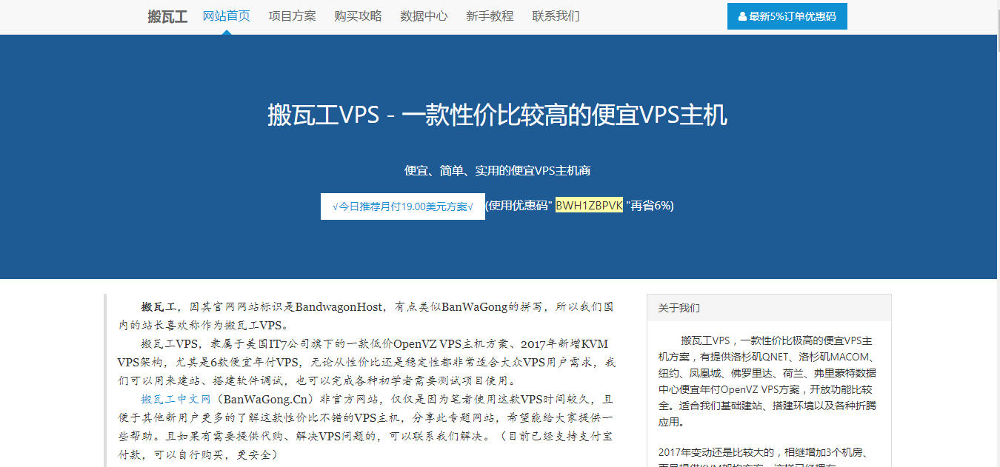
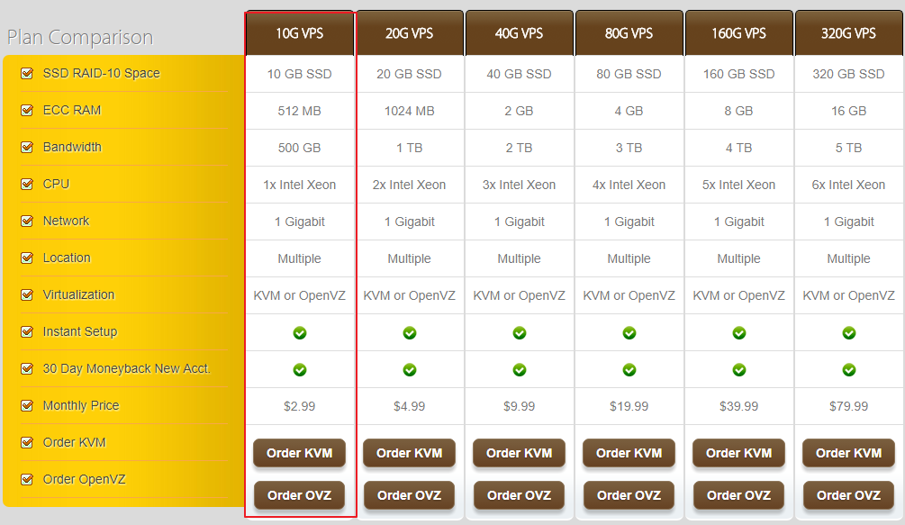
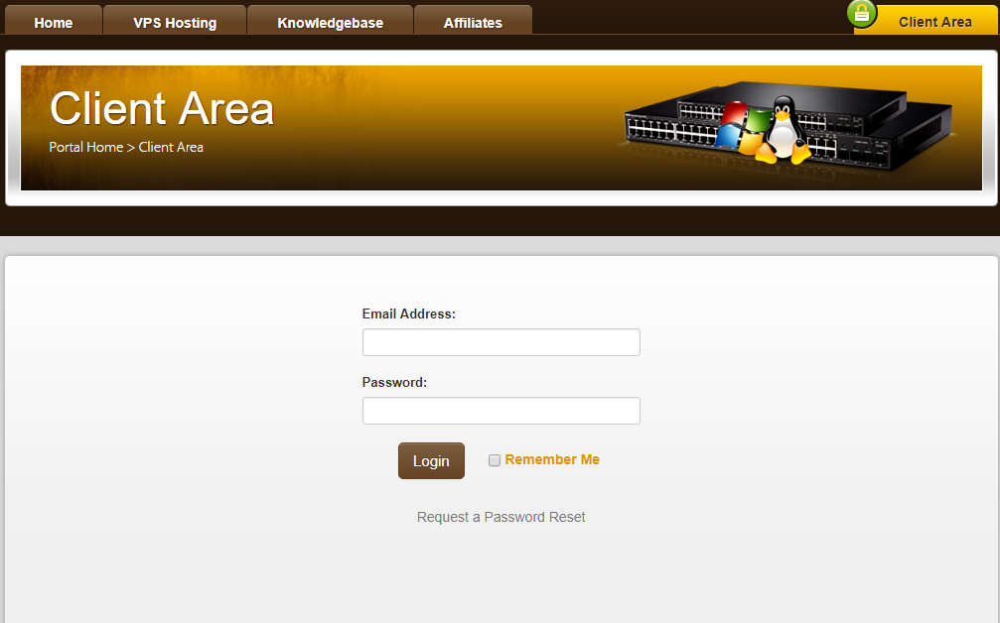
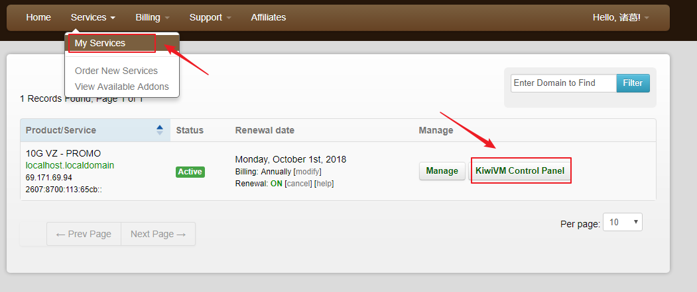
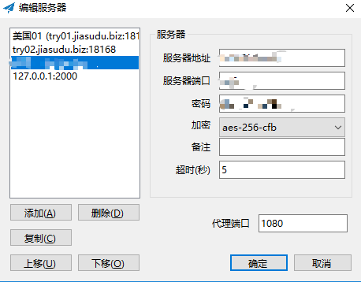

# 搬瓦工服务器搭建与使用
花费了一天的时间来搭建搬瓦工服务器一家Shadowsocks的配置，主要过程为：
- 购买 [搬瓦工服务器](https://bandwagonhost.com/) [国内镜像网站](http://banwagong.cn/)!
- 在服务器上使用一键安装Shadowsocks功能
- 客户端上安装Shadosocks软件

<!-- more -->

## 购买BandwagongHost（俗称搬瓦工）服务器

购买时选择KVM架构的服务器，因为可以选择安装`centos-6-x86_64-bbr` 系统（默认安装，加速），同时还可以选择其他加速方式，两者的主要区别是：
OpenVZ advantages:
- IPv6 support
- Better CPU performance
KVM advantages:
- Full virtualization
- Custom kernel support (BBR, etc)
- Docker support
- Better isolation
- Better network throughput

点击购买就可以了,可以选择支付宝付款。购买成功之后会选择发送邮件到你注册时使用的邮箱中，具体信息可以登入到网站中查看

在服务器中先选择安装系统，最好安装`centos-6 x86系统`，然后可以选择一件安装`Shadowsocks Serve`r,安装完之后会显示端口、密码等相关信息，这些信息是填写客户端（PC端）上面。
## 客户端安装Shadowsocks
windows版安装就和平时安装软件一样，点击下一步就可以，安装完之后填写服务器、密码、端口号相关信息就可以了。
下载地址：[官方下载页](https://github.com/shadowsocks/shadowsocks-windows/releases)

