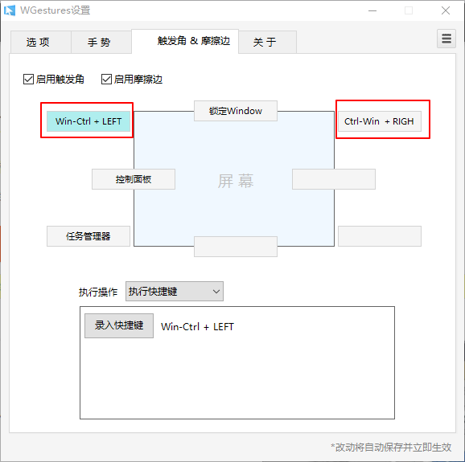
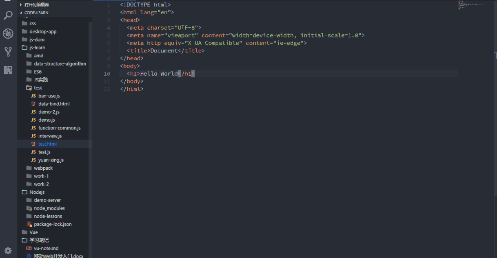
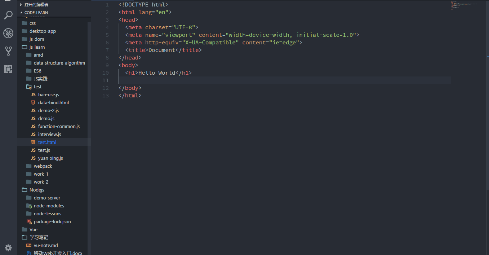

一般我会新建三个桌面，一个看文档，一个写代码，另一个看调试结果。虽然可以在一个桌面中直接使用 `ALT + TAB` 组合键来进行切换，但是软件多起来就会发现很乱。使用分屏会更加简洁方便。
在切换桌面可以使用 [WGestures](http://www.yingdev.com/projects/wgestures) 软件，通过鼠标触碰桌面的左上角和右上角来进行切换上下桌面。安装后可以设置一下快捷键，当然也可以直接通过`Win+Ctrl+Left/Right`组合键来切换。如图：

vscode 使用全屏模式，左边的桌面可以查看文档，查资料，右边的桌面查看调试结果，中间的写代码，是不是很爽 😄

这里推荐一个 vscode 插件 `Live Server`，通过点击右下角的**Go Live**按钮，可以在本地启动一个服务器，同时他支持热更新，直接保存就可以刷新页面。
在编辑器中编辑之后直接保存，在浏览器中会自动刷新页面。
