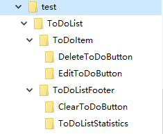
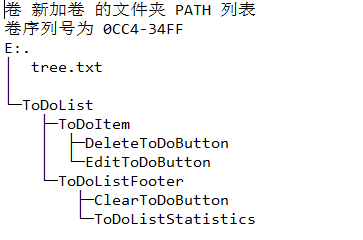

# 了解

在看[Vue.js](https://cn.vuejs.org/v2/guide/instance.html)的官方文档时，看到了这样的目录图，当时就好奇这是怎么写出来的，是由专门的语法还是通过手打出来的，于是就上网查找，发现原来这是通过`tree`命令来实现。


<!--more-->

# 查找

tree命令格式:
`TREE [drive:][path] [/F] [/A]`
> /F 显示每个文件夹中文件的名称。使用时显示所有目录及目录下的所有文件，省略时，只显示目录，不显示目录下的文件;
> /A 使用 ASCII 字符，而不使用扩展字符。

在 `Linux` 和 `Mac OS` 系统中tree命令有更强大的功能，但在Windows下只有 `/F` `/A`

# 实践

OK，Let's do it now ! :smile:
首先，建立相关的测试文件夹

然后在DOS中进入目录 `E:\test>`
输入相关命令，你可以选择在DOS中直接显示，也可以存为txt文件
```
tree /f              // 直接显示
tree /f > tree.txt   // 存为txt文件
```
结果：

之后就可以复制其中的内容了 
```
└─ToDoList
    ├─ToDoItem
    │  ├─DeleteToDoButton
    │  └─EditToDoButton
    └─ToDoListFooter
        ├─ClearToDoButton
        └─ToDoListStatistics
```